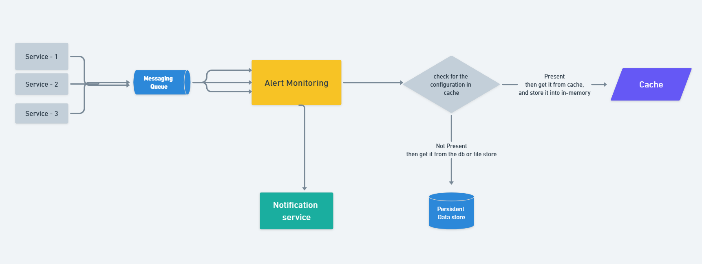

# Alert Monitoring System

### Problem Statement

Consider a microservice env where several systems use 1 central system for all their alert use
cases: Design and implement a system which can capture events generated by any system or
user triggered (for simplicity), and raise an alert according to alert configuration.

### Type of configurations:

`SIMPLE_COUNT`      : which consists of count
`TUMBLING_WINDOW` :  which consists of count and windowSizeInSecs, Eg: 10 events in 1 hour
                                  bucket, you can assume that the bucket starts at 00:00 hour of the day
`SLIDING_WINDOW`   :  which consists of count and windowSizeInSecs

### Example client configuration:

```json
[
    {
        "client": "X",
        "eventType": "PAYMENT_SERVICE_EXCEPTION",
        "alertConfig": {
            "type": "TUMBLING_WINDOW",
            "count": 2,
            "windowSizeInSecs": 10
        },
        "dispatchStrategyList": [
            {
                "type": "CONSOLE",
                "message": "issue in payment"
            },
            {
                "type": "EMAIL",
                "subject": "payment exception threshold breached"
            }
        ]
    },
    {
        "client": "Y",
        "eventType": "PAYMENT_SERVICE_EXCEPTION",
        "alertConfig": {
            "type": "TUMBLING_WINDOW",
            "count": 2,
            "windowSizeInSecs": 10
        },
        "dispatchStrategyList": [
            {
                "type": "CONSOLE",
                "message": "issue in payment"
            },
            {
                "type": "EMAIL",
                "subject": "payment exception threshold breached"
            }
        ]
    },
    {
        "client": "X",
        "eventType": "USER_SERVICE_EXCEPTION",
        "alertConfig": {
            "type": "SLIDING_WINDOW",
            "count": 2,
            "windowSizeInSecs": 5
        },
        "dispatchStrategyList": [
            {
                "type": "CONSOLE",
                "message": "issue in user service"
            }
        ]
    },
    {
        "client": "X",
        "eventType": "UNAUTHORIZED_EXCEPTION",
        "alertConfig": {
            "type": "SIMPLE_COUNT",
            "count": 1
        },
        "dispatchStrategyList": [
            {
                "type": "CONSOLE",
                "message": "unauthorized access"
            }
        ]
    },
    {
        "client": "Y",
        "eventType": "UNAUTHORIZED_EXCEPTION",
        "alertConfig": {
            "type": "SIMPLE_COUNT",
            "count": 1
        },
        "dispatchStrategyList": [
            {
                "type": "CONSOLE",
                "message": "unauthorized access"
            }
        ]
    }
]

```

### Sample Execution

● Alert will be dispatched if the config thresholds are met
● You can design your own config.
● You need to keep a placeholder for defining different dispatch mechanisms. (You may
provide implementation for console dispatch)
● Simulate the dispatch of alerts by generating events in a main class / test case

### Sample Output

[INFO] MonitoringService: Client X PAYMENT_EXCEPTION TUMBLING_WINDOW
starts
[INFO] MonitoringService: Client X PAYMENT_EXCEPTION TUMBLING_WINDOW
ends
[INFO] MonitoringService: Client X PAYMENT_EXCEPTION TUMBLING_WINDOW
starts
[INFO] MonitoringService: Client X PAYMENT_EXCEPTION threshold
breached
[INFO] AlertingService: Dispatching to Console
[WARN] Alert: `issue in payment`
[INFO] AlertingService: Dispatching an Email
[INFO] MonitoringService: Client X USERSERVICE_EXCEPTION threshold
breached
[INFO] AlertingService: Dispatching to Console
[WARN] Alert: `issue in user service`
[INFO] MonitoringService: Client X PAYMENT_EXCEPTION TUMBLING_WINDOW
ends

### Evaluation

● Code modularity, readability and testability
● Refactored code
● Abstraction
● Language proficiency.
● Functional coverage
● Separation of concerns
● Application of OO design principles
● Data structures and optimal time complexit

---

Lets Understand the Problem

### 1. SIMPLE_COUNT

**Definition**: Raise an alert after a certain number of events have occurred.

**Example**:

- Configuration:
    - Type: `SIMPLE_COUNT`
    - Count: `5`

**Scenario**:

- Suppose we receive events of type `PAYMENT_EXCEPTION` for a client.
- We configured the system to raise an alert after 5 such events.

**Execution**:

1. Event 1 occurs.
2. Event 2 occurs.
3. Event 3 occurs.
4. Event 4 occurs.
5. Event 5 occurs.

After the 5th event, the system raises an alert because the count threshold (5) is met.

### 2. TUMBLING_WINDOW

**Definition**: Raise an alert if a specified number of events occur within a fixed time window. The window is a fixed period and resets after each interval.

**Example**:

- Configuration:
    - Type: `TUMBLING_WINDOW`
    - Count: `10`
    - Window Size: `3600` seconds (1 hour)

**Scenario**:

- The tumbling window starts at the beginning of each hour.
- We need to receive 10 events within any hour to trigger an alert.

**Execution**:

1. Window starts at 12:00 PM.
2. Between 12:00 PM and 1:00 PM, 10 events occur.
    - Event 1 at 12:05 PM.
    - Event 2 at 12:10 PM.
    - ...
    - Event 10 at 12:55 PM.

At 12:55 PM, after the 10th event, the system raises an alert. The window resets at 1:00 PM.

### 3. SLIDING_WINDOW

**Definition**: Raise an alert if a specified number of events occur within a moving time window. The window moves continuously as new events come in.

**Example**:

- Configuration:
    - Type: `SLIDING_WINDOW`
    - Count: `5`
    - Window Size: `600` seconds (10 minutes)

**Scenario**:

- The sliding window continuously checks the last 10 minutes from the current event time.
- We need to receive 5 events within any 10-minute window to trigger an alert.

**Execution**:

1. Event 1 occurs at 2:00 PM.
2. Event 2 occurs at 2:02 PM.
3. Event 3 occurs at 2:05 PM.
4. Event 4 occurs at 2:08 PM.
5. Event 5 occurs at 2:10 PM.

At 2:10 PM, the system checks the last 10 minutes (from 2:00 PM to 2:10 PM) and finds 5 events, so it raises an alert.

If another event (Event 6) occurs at 2:12 PM, the system will again check the last 10 minutes (from 2:02 PM to 2:12 PM) and still see 5 events (from Event 2 to Event 6). This moving window continuously evaluates the last 10 minutes from each new event's timestamp.

---

`Note:`  In this repository we have only focused on building the alert monitoring service.

### Project Directory Tree

```
├───src
│   ├───main
│   │   ├───java
│   │   │   └───com
│   │   │       └───sanketbadjate
│   │   │           └───alert_monitor
│   │   │               │   AlertMonitorApplication.java
│   │   │               │
│   │   │               ├───constants
│   │   │               │       ApplicationConstants.java
│   │   │               │       LoggerConstants.java
│   │   │               │
│   │   │               ├───enums
│   │   │               │       AlertStrategy.java
│   │   │               │       AlertType.java
│   │   │               │       Client.java
│   │   │               │       EventType.java
│   │   │               │       LogType.java
│   │   │               │
│   │   │               ├───models
│   │   │               │       Event.java
│   │   │               │
│   │   │               ├───repositories
│   │   │               │       EventRepository.java
│   │   │               │
│   │   │               ├───services
│   │   │               │   │   AlertingService.java
│   │   │               │   │   LoggerService.java
│   │   │               │   │   MonitoringService.java
│   │   │               │   │
│   │   │               │   └───repositoryServices
│   │   │               │           EventsRepositoryService.java
│   │   │               │
│   │   │               └───utils
│   │   │                   ├───config
│   │   │                   │       AlertConfig.java
│   │   │                   │       AppConfig.java
│   │   │                   │       ConfigUpdater.java
│   │   │                   │       ServiceEventAlertConfig.java
│   │   │                   │       ServiceEventAlertConfig.json
│   │   │                   │       SimpleAlertConfig.java
│   │   │                   │       SlidingWindowAlertConfig.java
│   │   │                   │       TumblingWindowAlertConfig.java
│   │   │                   │       WindowAlertConfig.java
│   │   │                   │
│   │   │                   ├───dispatchStrategy
│   │   │                   │       Alert.java
│   │   │                   │       ConsoleAlert.java
│   │   │                   │       EmailAlert.java
│   │   │                   │
│   │   │                   └───eventProcessor
│   │   │                           EventProcessor.java
│   │   │                           EventProcessorFactory.java
│   │   │                           SimpleEventProcessor.java
│   │   │                           SlidingWindowEventProcessor.java
│   │   │                           TumblingWindowEventProcessor.java
│   │   │                           WindowEventProcessor.java
│   │   │
│   │   └───resources
│   │           application.properties
```

### Branches Overview:

- **master**: Main development branch for stable releases.
- **fallback**: Branch with fallback mechanism code, uses local configuration files if GitHub fetch fails.

`Note:` The main code is present in the `master` branch and I have also develop the fall-back feature, you can refer that in **`FEATURE_fall_back`** branch.

## Future Scope :

## 1. Example

Imagine a scenario where a large-scale application is generating various types of events such as payment service exceptions, user service exceptions, and unauthorized access attempts. The monitoring system needs to continuously analyze these events, apply alert thresholds, and notify relevant stakeholders via various alerting channels (e.g., email, SMS).

## 2. Functional Requirements

### Key Features:

- **Real-time Event Processing**: Process incoming events in real-time to detect anomalies or critical conditions.
- **Threshold-based Alerting**: Trigger alerts when predefined thresholds for specific event types are breached.
- **Dynamic Configuration Update**: Fetch updated alert configurations from a GitHub repository at regular intervals.
- **Fallback Mechanism**: Use local configuration files stored within the project structure if unable to retrieve configurations from GitHub.
- **Support for Multiple Clients**: Manage configurations and alerts for different clients or applications.
- **Logging and Monitoring**: Implement logging mechanisms to track system behavior and monitor performance.

**Enhanced Alerting**: Implement more sophisticated alerting strategies (e.g., machine learning-based anomaly detection).

- **Scalability**: Scale the system to handle larger volumes of events and users.
- **Integration with Monitoring Tools**: Integrate with external monitoring tools (e.g., Prometheus, Grafana) for better visibility.
- **User Interface**: Develop a user-friendly dashboard to visualize event trends and alert statuses.

System Diagram: 



### Security:

Authentication and Authorization using OAuth2 for incoming requests from the client.

### Rate Limiting:

Rate limiting is used to handle various types of attacks, but one specific type that it helps mitigate is the Distributed Denial of Service (DDoS) attack. DDoS attacks aim to overwhelm a target system by flooding it with a high volume of requests or traffic, making the system unavailable to legitimate users.

## Show Some Love ❤️

If you find this project useful or interesting, please consider giving it a star on GitHub. Your support is what keeps us motivated!
